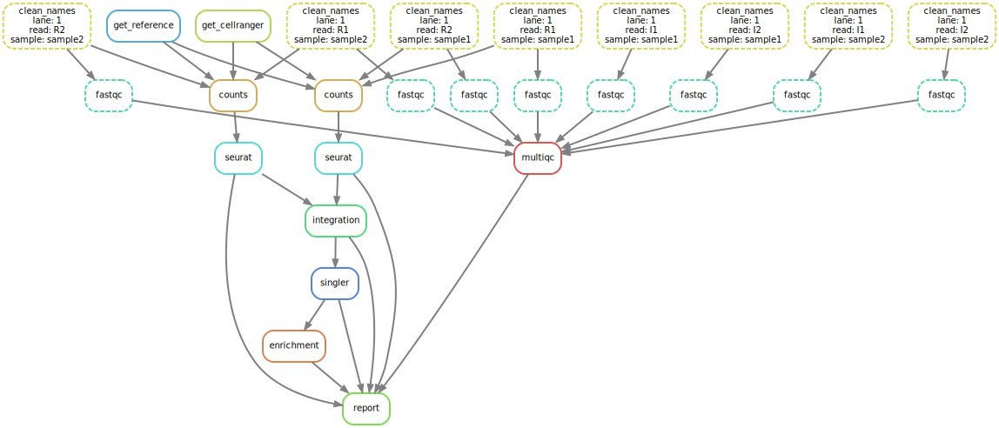

此流程仅用于 10x 平台单细胞准转录组、空间组和免疫组学数据分析。
# 使用说明
## 流程图示例

## 流程环境
``conda activate /public/home/weiyifan/miniforge3/envs/sk8``
## 流程部署
``snakedeploy deploy-workflow https://github.com/joyling93/sc10x_wf . --tag v1.1.6``
## 配置信息
config.yaml(config_space.yaml、config_multi为测试用例);
samples.yaml
## 流程运行
``snakemake -c30 --use-conda --cache``

# 样本配置
## 转录组和空间组流程
"1":  #代表批次号，无需修改  
  sample1:   #代表样本名称,注意数据后缀有的数据只有R1，有的数据有R1和R2，有的数据有I1或I2  
    R1: "path to R1.fastq.gz"  
    R2: "path to R2.fastq.gz"  
    I1: "path to I1.fastq.gz"  
    I2: "path to I2.fastq.gz"  
    image: #默认没有值，空间流程时填写tiff图片位置  
    slide: #默认没有值，空间流程时填写slide位置  
    area: #默认没有值，空间流程时填写area位置  
## vdj流程
"1":  #代表批次号，无需修改  
  sample1-gex:   #代表样本转录组数据,注意数据后缀有的数据只有R1，有的数据有R2，有的数据有I1或I2  
    R1: "path to R1.fastq.gz"  
    R2: "path to R2.fastq.gz"  
    I1: "path to I1.fastq.gz"  
    I2: "path to I2.fastq.gz"  
    csv: #默认没有值，vdj流程时填写 multi 流程所需csv文件，详见示例说明  
  sample1-vdj:   #代表样本配对vdj数据,注意样本名和gex需完全相同  
    R1: "path to R1.fastq.gz"  
    R2: "path to R2.fastq.gz"  
    I1: "path to I1.fastq.gz"  
    I2: "path to I2.fastq.gz"  
    csv: #默认没有值，vdj流程时仅在sample1-gex下填写一次即可  

# 参数配置

samples: "config/samples.yaml" # 样本配置文件地址  
species: "homo_sapiens" # 目前仅可填 mus_musculus|homo_sapiens  
pipeline: "cellranger" # cellranger|spaceranger|multi 分别对应转录组、空间组和vdj流程  
fq_type: # index类型,根据原始数据后缀修改，没有的直接删除  
  - "R1"  
  - "R2"  
  - "I1"  
  - "I2"  

counts: # cellranger定量时的参数，一般不需修改  
  introns: False #定量时是否包含内含子  
  n_cells: 3000  
  mem: 190   

vdj_type: #仅在multi流程使用, TCR|BCR  

get_cellranger: #目前使用的软件版本目录，不要修改  
  cellranger:   
    bin: "/public/home/weiyifan/xzm/soft/cellranger-7.2.0/cellranger"  
  spaceranger:   
    bin: "/public/home/weiyifan/xzm/soft/spaceranger-3.1.1/spaceranger"  
  multi:  
    bin: "/public/home/weiyifan/xzm/soft/cellranger-7.2.0/cellranger"  

get_reference: #目前使用的参考基因版本目录，不要修改  
  homo_sapiens: "/public/home/weiyifan/xzm/ref/10x/refdata-gex-GRCh38-2020-A/"  
  mus_musculus: "/public/home/weiyifan/xzm/ref/10x/refdata-gex-mm10-2020-A/"  

## 以下配置暂未启用，不要删改，未来可能会弃用
filter_empty:  
  niters: 30000  

qc:  
  pct_counts_mt: 5  
  total_counts: 60000  
  n_genes_by_counts: 2000  

dim_reduc:  
  var_thresh: 0.75  

cluster:  
  res: 0.6  