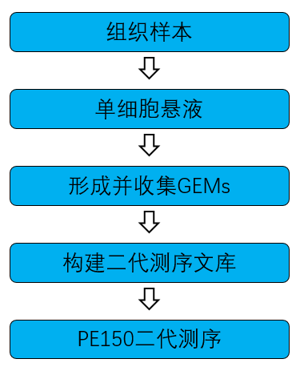
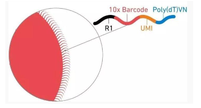
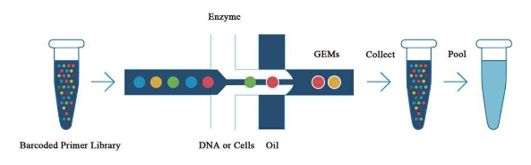
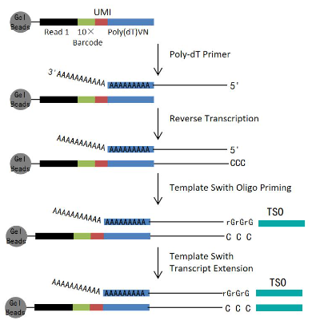
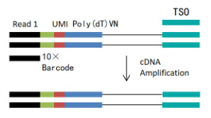
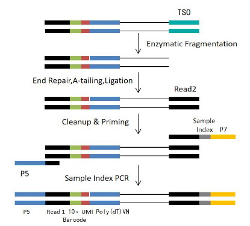
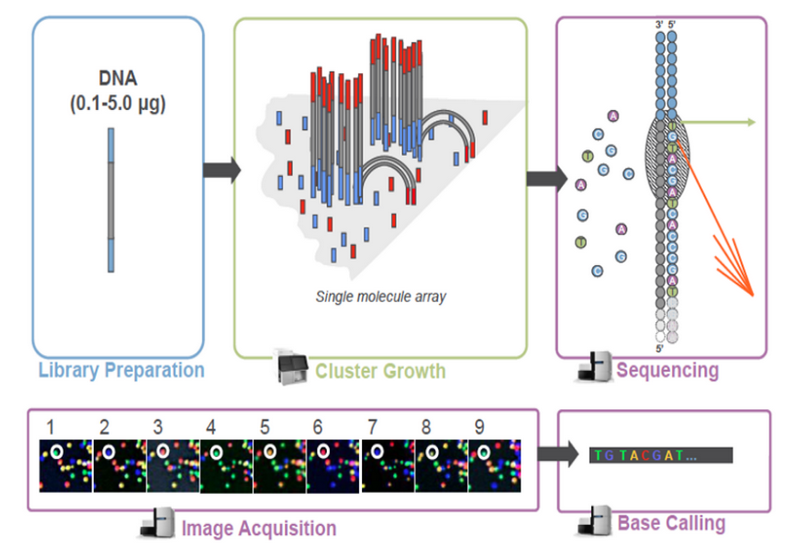
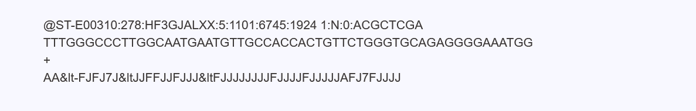
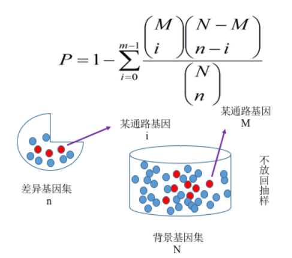

```{r setup, include=FALSE}
knitr::opts_chunk$set(echo = FALSE)
```

```{r,fig.align="left",out.height='25%',out.width='25%',echo = FALSE}

```

## 概述

单细胞转录组测序是一项可以在单细胞水平测定细胞的转录组的技术，利用该技术可以回答样本中每个细胞基因表达情况与细胞间异质性问题，这让解析细胞行为，机制及相互关系成为可能。\
10X Genomics 单细胞转录组测序平台利用微流控、油包水以及单细胞标签等技术实现了高通量的细胞捕获。能够一次性标记 500-10000 个细胞。并结合转录本3’端获取的转录组信息从而实现研究单个细胞基因表达情况的目的。与其他单细胞转录组技术相比，该技术具有通量高，成本低，周期短等显著优势。\
该技术可用于细胞分型与细胞标记分子的鉴定并进一步实现对细胞群体的划分与细胞群体间基因表达差异的检测，此外还可以利用该平台产生的数据预测细胞分化与发育轨迹。在发育、免疫、疾病领域的研究中发挥越来越重要的作用。

### 单细胞建库测序

从组织样本单细胞分离到最终数据获得，样品检测、单细胞分离、单细胞建库、测序等每一环节都会直接影响数据的数量和质量，从而影响后续信息分析的结果。为从源头保证测序数据准确可靠，承诺在数据的所有生产环节都严格把关，从根源上确保高质量数据的产出。建库测序的流程图如下：

```{r,fig.align="center",fig.cap = "单细胞建库流程"}


```

### 单细胞悬液样本制备

根据不同样本的特性将样本制备成单细胞悬浮液，对悬液中的细胞质检包括细胞计数和细胞活性测定，最终悬液中的细胞活性应高于 90%，细胞浓度为 700～1200 个细胞/μl。

### 形成与收集GEM

10X单细胞平台采用基于微滴条形码分配系统，该系统为样本提供了百万级的携带唯一DNA条形码的凝胶珠，再结合微流控技术，将带有条形码和引物的凝胶珠与单细胞悬液中的细胞包裹在油包水的液滴（GEMs）中。 该系统共约有75万种带有标签的凝胶珠，每个珠子上有 40-80 万探针。探针的引物序列包含四个部分：\
1. Illumina TruSeq Read 1测序引物。\
2. 16 bp 的细胞识别条形码（Barcode）。\
3. 12 bp 的 RNA 独立分子标签（UMI）。\
4. 30 bp 的 Poly(dT) 反转录引物。\
Illumina TruSeq Read 1测序引物，用于后续的上机测序。16 nt的细胞识别条形码有 400 万种细胞识别条形码，一个凝胶珠仅含有一种细胞识别条形码，通过这 400 万种条形码，从而将其对应的细胞区分开。12 bp 的 RNA 独立分子标签是由随机碱基组成的一段序列，捕获到的每一个核酸分子都将分配有特异的 UMI 序列，能够区分哪些 reads 是来自于一个原始 RNA 分子，从而区分基因片段是否为 PCR 的扩增重复及区分是真实的单核苷酸多态性（SNP）位点还是 PCR 产生的突变。30bp 的 Poly(dT) 反转录引物，是含有 30 个 T 碱基的同聚 DNA 片段，用于捕获有 polyA 尾的转录本。

```{r,fig.align="center",fig.cap = "凝胶珠结构"}


```

```{r,fig.align="center",fig.cap = "GEMs生成过程示意图"}


```

### 文库构建与质检

#### 文库构建

油滴形成后，凝胶珠在油滴内溶解并释放大量探针，细胞裂解释放 mRNA ，mRNA 与油滴内的探针结合并在逆转录酶的作用下产生用于测序的带有细胞标签和 UMI 信息的 cDNA 一链，再以 SMART 扩增方法完成第二链合成。

```{r,fig.align="center",fig.cap = "标签添加与一链合成示意图"}


```

油滴破碎，使用磁珠纯化 cDNA 一链，然后进行 PCR 扩增。

```{r,fig.align="center",fig.cap = "二链合成示意图"}


```

cDNA 扩增完成后，利用化学方法将 cDNA 打断成 200-300bp 左右的片段，并构建含有 P5 和 P7 接头的 cDNA 文库。

```{r,fig.align="center",fig.cap = "测序文库构建示意图"}


```

### 文库构建与质检

文库构建完成后，先使用 Qubit2.0 Fluorometer 进行初步定量，稀释文库至 1.5ng/ul，随后使用 Agilent 2100 bioanalyzer 对文库的 insert size 进行检测，insert size 符合预期后，qRT-PCR 对文库有效浓度进行准确定量（文库有效浓度高于 2nM ），以保证文库质量。

### 上机测序

库检合格后，把不同文库按照有效浓度及目标下机数据量的需求 pooling 后进行 Illumina 测序。测序的基本原理是边合成边测序（Sequencing by Synthesis）。在测序的 flow cell 中加入四种荧光标记的 dNTP、DNA 聚合酶以及接头引物进行扩增，在每一个测序簇延伸互补链时，每加入一个被荧光标记的 dNTP 就能释放出相对应的荧光，测序仪通过捕获荧光信号，并通过计算机软件将光信号转化为测序峰，从而获得待测片段的序列信息。测序过程如下图所示:

```{r,fig.align="center",fig.cap = "Illumina测序原理示意图"}


```

## 信息分析流程

对于单细胞转录组的分析，首先使用 CellRanager 对测序数据进行质控，比对后根据细胞标签与分子标签产生单细胞基因表达矩阵并根据每个细胞的表达谱特征去除低质量的细胞。使用 Seurat 软件识别与解释单细胞原始的表达矩阵中异质性的来源，该步骤主要包括细胞与基因的质量控制，降维与聚类，标记基因鉴定与差异分析等。在得到不同类的标记基因后使用 Singler 软件对不同的细胞类群进行细胞类型注释。在完成标记基因鉴定与差异分析后使用 ClusterProfiler 软件对挑选出的基因集进行富集分析。

### 原始数据质量控制

#### 测序数据说明

测序片段被高通量测序仪测得的图像数据经 CASAVA 碱基识别转化为序列数据（reads），文件为 fastq 格式，其中主要包含测序片段的序列信息以及其对应的测序质量信息。\
单个样本的 10X 单细胞测序数据一般分成 I1，R1，R2 三个测序文件。 R1 文件每条序列包含 26 个碱基细胞识别条形码，10 个碱基 UMI。I1 文件包含8碱基的样本识别标签。R2 文件包含转录本测序信息。 fastq 格式文件中每个 read 由四行描述信息组成，如下所示：

```{r,fig.align="center",fig.cap = "测序fastq文件格式图"}


```

上述文件中第一行以“\@”开头，随后为 Illumina 测序标识符 (Squence Identifiers) 和描述文字；第二行是测序片段的碱基序列；第三行以“+”开头，随后为 llumina 测序标识符(也可为空)；第四行是测序片段每个碱基相对应的测序质量值，该行每个字符对应的 ASCII 值减去 33，即为该碱基的测序质量值。

#### 测序错误率分布

测序过程本身存在机器错误的可能性，测序错误率分布检查可以反映测序数据的质量，序列信息中每个碱基的测序质量值保存在 fastq 文件中。如果测序错误率用 e 表示，Illumina 的碱基质量值用 Qphred 表示，则有：Qphred=-10log10(e) 。Illumina Casava 1.8 版本碱基识别与 Phred 分值之间的简明对应关系见下表。

| Phred 分值 | 不正确的碱基识别 | 碱基正确识别率 | Q.sorce |
|:-----------|:-----------------|:---------------|:--------|
| 10         | 1/10             | 90%            | Q10     |
| 20         | 1/100            | 99%            | Q20     |
| 30         | 1/1000           | 99.90%         | Q30     |
| 40         | 1/10000          | 99.99%         | Q40     |

### Cellranger 分析

CellRanger 是 10X genomics 官方提供的一套针对单细胞 RNA 测序输出结果进行比对、定量、聚类及基因表达分析的分析流程。\
CellRanger 对单细胞测序数据进行以下 5 步处理：\
1. 对测序数据进行修剪，去除poly-A 尾与 TSO 序列结构。\
2. 使用 STAR 对测序数据进行比对并判断 reads 是比对到了外显子、内含子还是基因间区上。\
3. 在定量前，对 UMI 的测序错误进行矫正。\
4. 依据 UMI 进行定量。\
5. 过滤低质量细胞。\

#### CellRnager 分析结果

CellRanger 分析结果主要包括：\
1. CellRanger 网页版分析报告。包括异常结果警报，细胞和基因数目的评估，比对比例统计及部分基础分析的结果(results/counts/-/outs/web_summary.html)。\
2. CellRanger 定量单细胞原始表达矩阵与过滤后的表达矩阵。(results/counts/-/outs/filtered_feature_bc_matrix;results/counts/-/outs/raw_feature_bc_matrix)

### 单细胞转录组基因与细胞质量控制

10X 项目捕获到的细胞中，部分细胞活性低甚至为死细胞，而部分液滴可能包含了两个或多个细胞，这些低质量数据会对后续信息分析造成很大干扰。高质量的测序数据是后续信息分析结果可靠性的前提，因此需要对原始数据进行严格的数据预处理和评估。我们选取 Seurat[^1]数据分析 R 包进行低质量细胞的过滤，基于 10X 项目中细胞表达的基因数量，针对不同类型的样本，采用不同的阈值对低质量的细胞进行过滤，进而提高分析结果质量，过滤内容包括如下部分：\
1. 去除单个细胞中检测到的基因数目小于 200 的细胞\
2. 去除线粒体含量高于一定比例（默认为 20%）的细胞

[^1]: A. Butler, P. Hoffman, P. Smibert, E. Papalexi, and R. Satija, (2018), Integrating single-cell transcriptomic data across different conditions, technologies, and species, Nature Biotechnology, 36, 411-420.

细胞过滤阈值和指标见下表：

```{r }

library(purrr)
fl<-list.files("../../results/seurat",pattern = '_filter_stat',recursive = T,full.names = T)
map_dfr(fl,function(x){
  read.delim(x)
})%>%knitr::kable(caption = '样本过滤细胞数统计')
```

-   cellNum: 未过滤样本细胞数
-   umiThreshold: umi 过滤阈值
-   umiFilter: umi 阈值过滤后细胞数
-   mitoThrehold: 线粒体比例过滤阈值
-   mitoFilter: 线粒体比例阈值过滤后细胞数

### 样本整合和聚类

过滤后的样本会先经过 CCA 整合，再使用基于图论的聚类算法对细胞进行降维（PCA、UMAP[^2]）和聚类，最后进行聚类间的差异分析，确定聚类的 marker gene。

[^2]: L. McInnes, and J. Healy, (2018), UMAP: Uniform manifold approximation and projection for dimension reduction.

#### 结果展示 {.tabset .tabset-fade .tabset-pills}

##### 样本分布UMAP

```{r ,fig.align='center', out.height='5%'}

library(purrr)
fl<-list.files("../../results/integration/Anchors",pattern = 'sample_UMAP.png',recursive = T,full.names = T)
knitr::include_graphics(fl)
```

##### 聚类比例分布

```{r ,fig.align='center', out.height='50%',fig.show='hold'}

library(purrr)
fl<-list.files("../../results/integration/",pattern = 'persent.png',recursive = T,full.names = T)
knitr::include_graphics(fl)
```

##### 聚类marker热图

```{r ,fig.align='center', out.height='25%',fig.show='hold'}

library(purrr)
fl<-list.files("../../results/integration/",pattern = 'Heatmap',recursive = T,full.names = T)
knitr::include_graphics(fl)
```

### SingleR注释

除此之外， 我们还采用了 SingleR（Single-cell Recognition of cell types），一种新的 scRNA-seq 无偏差细胞类型识别的计算方法。 SingleR 通过比较每个聚类亚群与已知细胞类型的表达谱的相似性来独立推断每个单细胞的细胞可能类型。 将 Seurat 方法与 SingleR 的注释相结合，可以为 scRNA-seq 数据的研究提供更好的帮助。

```{r ,fig.align='center', out.height='50%',fig.cap='细胞分布UMAP',fig.show='hold'}

library(purrr)
fl<-list.files("../../results/singler",pattern = 'singler_umap.png',recursive = T,full.names = T)
knitr::include_graphics(fl)
```

### 差异 marker分析

Seurat 可以通过一个细胞亚群与所有其他细胞群进行比较，得到该群细胞与其他群细胞之间的差异基因列表。Seurat 程序包通过差异分析算法（默认采用 Wilcoxon rank sum test）来寻找各个细胞群的差异高表达基因。

```{r }

library(purrr)
fl<-list.files("../../results/singler",pattern = 'FindAllMarkers.xls',recursive = T,full.names = T)
map_dfr(fl,function(x){
  read.delim(x,nrows = 6)
})%>%knitr::kable(caption = '细胞marker表')
```

-   cluster:聚类名称
-   avg_log2FC:平均表达量差异倍数
-   p_val:pvalue
-   p_val_adj:校正后的 pvalue
-   pct.1:基因在当前聚类的表达比例
-   pct.2:基因在当前其他聚类的表达比例

### marker 富集分析

对于不同的细胞类我们会得到很多的标记基因，这无疑增加了后续分析的复杂度。因此，可以将这些差异基因按照不同的功能类别进行分类，即对差异基因进行富集分析。通过富集分析，可以找到不同条件下的差异基因与哪些生物学功能或通路显著性相关，从而揭示和理解生物学过程的基本分子机制。 我们采用 clusterProfiler[^3] 软件对差异基因集进行GO功能富集分析，KEGG通路富集分析等。富集分析基于超几何分布原理，其中差异基因集为差异显著分析所得差异基因并注释到GO或KEGG数据库的基因集，背景基因集为所有参与差异分析并注释到GO或KEGG数据库的基因集。富集分析结果是对每个差异比较组合的所有差异基因集进行富集。

[^3]: G. Yu, L. G. Wang, Y. Han, and Q. Y. He, (2012), clusterProfiler: an R package for comparing biological themes among gene clusters, Omics A Journal of Integrative Biology, 16(5), 284-287.

```{r,fig.align="center",fig.cap = "富集分析原理图"}


```

#### GO 富集

GO(Gene Ontology)是描述基因功能的综合性数据库（<http://www.geneontology.org/>)，可分为生物过程（Biological Process）和细胞组成（Cellular Component）分子功能（Molecular Function）三个部分。GO 功能显著性富集分析给出与基因集背景相比，在差异表达基因中显著富集的 GO 功能 条目，从而给出差异表达基因与哪些生物学功能显著相关。该分析首先把所有差异表达基因向 Gene Ontology 数据库的各个 term 映射，计算每个 term 的基因数目，然后找出与整个基因集背景相比，在差异表达基因中显著富集。GO富集分析方法为clusterProfiler的enricher函数，该方法使用超几何分布检验的方法获得显著富集的GO Term。统计被显著富集的各个GOterm中的基因数,GO富集以padj小于0.05为显著富集。

##### 柱状图展示 {.tabset .tabset-fade .tabset-pills}

###### BP

```{r ,fig.align='center', out.height='50%',fig.cap='整合数据聚类marker热图'}

library(purrr)
fl<-list.files("../../results/enrichment/singler",pattern = 'bp_ora.png',recursive = T,full.names = T)
if(length(fl) >0 ){knitr::include_graphics(fl[[1]])}
```

###### MF

```{r ,fig.align='center', out.height='50%',fig.cap='整合数据聚类marker热图'}

library(purrr)
fl<-list.files("../../results/enrichment/singler/",pattern = 'mf_ora.png',recursive = T,full.names = T)
if(length(fl) >0 ){knitr::include_graphics(fl[[1]])}
```

###### CC

```{r ,fig.align='center', out.height='50%',fig.cap='整合数据聚类marker热图'}

library(purrr)
fl<-list.files("../../results/enrichment/singler/",pattern = 'CC_ora.png',recursive = T,full.names = T)
if(length(fl) >0 ){knitr::include_graphics(fl[[1]])}
```

#### KEGG 富集

在生物体内，不同基因相互协调行使其生物学功能，通过Pathway显著性富集能确定差异表达基因参与的最主要生化代谢途径和信号转导途径。 KEGG(Kyoto Encyclopedia of Genes and Genomes)是有关Pathway的主要公共数据库，其中整合了基因组化学和系统功能信息等众多内容。信息分析时，我们将KEGG数据库按照动物，植物，真菌等进行分类，依据研究物种的种属选择相应的类别进行分析。Pathway显著性富集分析以KEGG Pathway为单位，应用超几何检验，找出差异基因相对于所有有注释的基因显著富集的pathway，KEGG通路富集同样以padj小于0.05作为显著性富集的阈值。

```{r ,fig.align='center', out.height='200%',fig.cap='整合数据聚类marker热图',fig.show='hold'}

library(purrr)
fl<-list.files("../../results/enrichment/singler/",pattern = 'ora.png',recursive = T,full.names = T)
if(length(fl) >0 ){knitr::include_graphics(stringr::str_subset(fl,'kegg')[[1]])}
```

### 细胞间相互作用分析

CellPhoneDB[^4] 是一款专注于细胞间通讯研究的专业工具。它整合了来自多个权威数据源的细胞通讯相关数据，涵盖大量配体、受体及其相互作用信息，并考虑了配体和受体的亚基结构，能精准呈现细胞通讯的复杂关系。其拥有丰富的分析方法，包括简单与统计分析，以及多种相互作用优先排序策略，如 CellSign、环境筛选和评分方法等，可从单细胞转录组学数据中深度挖掘细胞间通讯网络。凭借持续更新优化的特性，广泛应用于疾病机制探索、发育生物学研究以及药物研发等领域，为科研人员揭示细胞通讯奥秘、寻找疾病靶点和开发新疗法提供有力支持，在细胞间通讯研究领域占据重要地位，有力推动了相关领域的科研进展。

[^4]: Garcia-Alonso, L., Lorenzi, V., Mazzeo, C.I. et al. Single-cell roadmap of human gonadal development. Nature 607, 540–547 (2022).

```{r }

library(purrr)
fl<-list.files("../../results/cpdb",pattern = 'interaction_scores',recursive = T,full.names = T)
map_dfr(fl,function(x){
  read.delim(x,nrows=6)[,1:7]
})%>%knitr::kable(caption = '细胞相互作用打分表(仅前5列)')
```
- id_cp_interaction: 相互作用编号
- interacting_pair: 相互作用受配体名称
- partner A or B: 相互作用受配体编号
- gene A or B: 相互作用受配体所属编号
- secreted: 相互作用受配体其一是否为分泌蛋白
- annotation_strategy: 相互作用数据来源
- is_integrin: 相互作用受配体其一是否为整合蛋白  

### 拟时序分析
拟时序分析是一种用于模拟细胞之间发育过程的方法，在细胞分裂发育过程中，都处在状态转换的过程中，假设该过程产生的蛋白和代谢物是动态保守的，那么我们可以利用该连续发生的状态转换来模拟细胞动态变化的过程，即重建了分化轨迹。  
该分析适用于已知存在连续分化过程的样本，如骨髓中存在着从干细胞到成熟细胞的分化过程，因此适用于拟时序分析。但是分化成熟的样本，如PBMC样本则不适合使用拟时序分析。  
细胞的伪轨迹构建流程包括如下步骤：
1. 选择定义过程的基因， Monocle[^5] 通过检查基因在整个群体中的表达模式来对细胞进行排序，寻找与发育过程相关的基因，并将这些基因作为机器学习方法的输入；
2. 数据降维，当选择了用于排序细胞的基因后， Monocle 使用逆向图嵌入的算法对数据进行降维处理；
3. 按伪时间对细胞进行排序， Monocle 假定该轨迹具有树形结构，一端为“根”节点，另一端为“叶子”，并采用流形学习的方法将细胞放置在树的合适位置上；选择与过程相关的基因用于下一步的轨迹构建。  

#### 基因筛选
下图展示了基因表达的可变性与细胞中平均表达水平的关系，红线显示的了基于此关系的期望值， 我们将用于后续的细胞亚群识别或沿轨迹排序细胞标记为黑点，而其他基于显示为灰点。
```{r ,fig.align='center', out.height='50%',fig.cap='基因筛选'}
library(purrr)
fl<-list.files("../../results/monocle/",pattern = 'ordering_genes.png',recursive = T,full.names = T)
if(length(fl) >0 ){knitr::include_graphics(fl[[1]])}
```
#### 结果展示  {.tabset .tabset-fade .tabset-pills}
##### 拟时序轨迹拟时分布图
```{r ,fig.align='center', out.height='50%',fig.cap='拟时序轨迹拟时分布图'}
library(purrr)
fl<-list.files("../../results/monocle/",pattern = 'Pseudotime_cell_trajectory.png',recursive = T,full.names = T)
if(length(fl) >0 ){knitr::include_graphics(fl[[1]])}
```
##### 拟时序轨迹聚类分布图
```{r ,fig.align='center', out.height='50%',fig.cap='拟时序轨迹拟时分布图'}
library(purrr)
fl<-list.files("../../results/monocle/",pattern = 'cell_trajectory.png',recursive = T,full.names = T)
if(length(fl) >0 ){knitr::include_graphics(fl[[1]])}
```
##### 拟时序轨迹stat分布图
```{r ,fig.align='center', out.height='50%',fig.cap='拟时序轨迹拟时分布图'}
library(purrr)
fl<-list.files("../../results/monocle/",pattern = 'cell_trajectory_stat.png',recursive = T,full.names = T)
if(length(fl) >0 ){knitr::include_graphics(fl[[1]])}
```

## 软件列表

| 分析内容       | 软件            | 版本 |
|:---------------|:----------------|:-----|
| 质控和差异分析 | Seurat          |4.4.0  |
| 细胞注释       | SingleR         |2.4.0 |
| 富集分析       | clusterProfiler |4.10.0|
| 细胞间相互作用 | cellphoneDB     |5.0.0|
| 拟时序分析      |monocle2        |2.34.0 |

## 参考文献
[^5]: Trapnell, C., Cacchiarelli, D., Grimsby, J. et al. The dynamics and regulators of cell fate decisions are revealed by pseudotemporal ordering of single cells. Nat Biotechnol 32, 381–386 (2014). https://doi.org/10.1038/nbt.2859